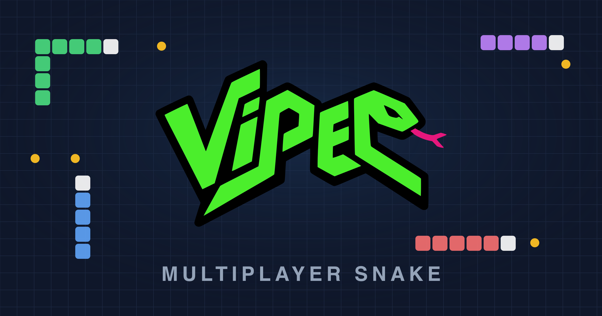
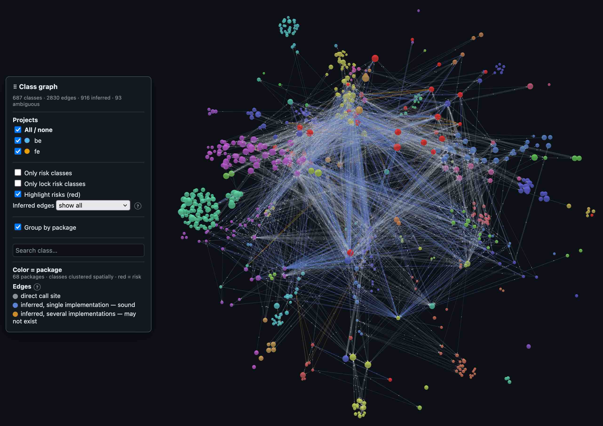
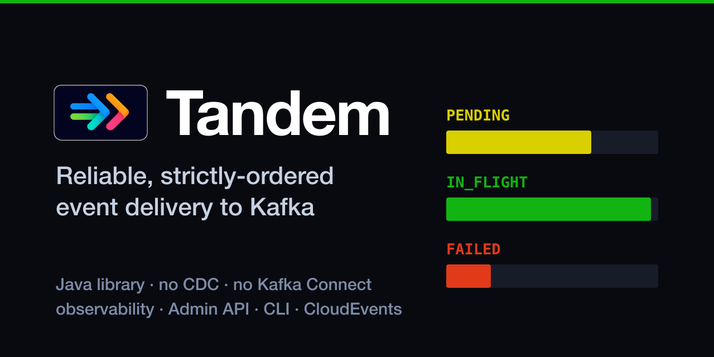
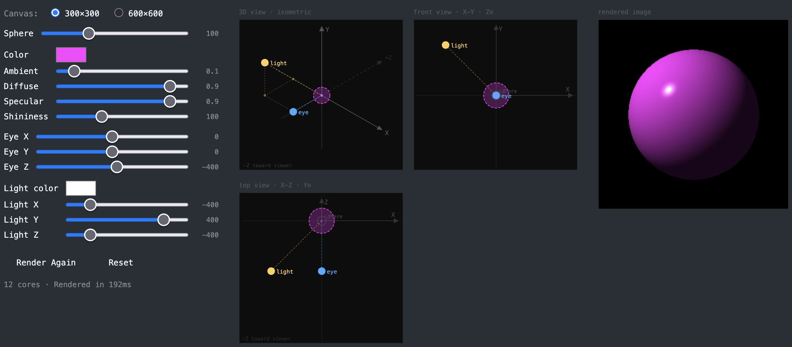

## Hi! 👋

I'm a software engineer and architect.

Here you can find my side works, tests, experiments and study materials.

🚀 I’m currently working on:

<table>
<tr>
<td width="240"></td>
<td>

**[My personal homepage](https://alirux.github.io/)**, an interactive generative-art scene of the Odle mountains. The sun, moon and stars move with real time, cows graze, the ISS crosses the sky, and a wolf is hidden somewhere for whoever finds it.

</td>
</tr>
<tr>
<td width="240"></td>
<td>

**[Viper](https://viper.codingful.com)**, a multiplayer Snake game built in Elixir. Up to 6 players share a board in real time: eat to grow, avoid the walls and everyone else's tail, and try to be the last one moving.

</td>
</tr>
<tr>
<td width="240"></td>
<td>

**[Carve](https://github.com/alirux/carve)**, an open source static analysis tool for Java/Spring codebases, built on Spoon and JGraphT. It maps call graphs to support modernising legacy Spring applications, flagging transaction risks and producing deterministic, machine-readable reports.

</td>
</tr>
<tr>
<td width="240"></td>
<td>

**[Tandem](https://tandem.codingful.com/)**, an [open source](https://github.com/alirux/tandem) Java library implementing the Transactional Outbox Pattern: reliable, strictly-ordered event delivery from your database to Apache Kafka, with no CDC, no Kafka Connect, and no two-phase commit.

</td>
</tr>
<tr>
<td width="240"></td>
<td>

**[My ray tracer in Elixir](https://my-elixir-ray-tracer.gigalixirapp.com/)**, an [open source](https://github.com/alirux/my-elixir-ray-tracer) project built by following the book *The Ray Tracer Challenge*: every ray, light and material parameter is tunable live, with shading computed using the Phong reflection model.

</td>
</tr>
</table>

I'm very happy to have made this [little contribution to the Phoenix framework](https://github.com/phoenixframework/phoenix/pull/3812), and even happier about José Valim's reaction to it 😊

<!--
**alirux/alirux** is a ✨ _special_ ✨ repository because its `README.md` (this file) appears on your GitHub profile.

Here are some ideas to get you started:

- 🔭 I’m currently working on ...
- 🌱 I’m currently learning ...
- 👯 I’m looking to collaborate on ...
- 🤔 I’m looking for help with ...
- 💬 Ask me about ...
- 📫 How to reach me: ...
- 😄 Pronouns: ...
- ⚡ Fun fact: ...
-->
